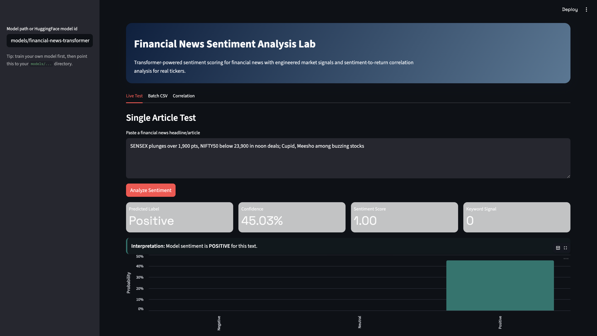

# Financial News Sentiment Analysis

End-to-end NLP project for classifying financial news sentiment with transformers and connecting sentiment signals to short-term stock movement.

## UI Preview


## Tech Stack
- Python, Pandas, NumPy
- HuggingFace Transformers + Datasets + PyTorch
- Scikit-learn metrics and splits
- Streamlit + Altair for interactive UI
- yfinance for market data

## What This Project Includes
- Transformer training pipeline for sentiment classification (`positive`, `neutral`, `negative`)
- Feature engineering layer:
  - entity mention counts
  - ticker mentions
  - keyword signal features
  - article length signals
- Batch inference pipeline for CSV files
- Correlation module to compare daily sentiment with future stock returns
- Streamlit interface where users can:
  - test a single article
  - upload a CSV and run batch scoring
  - run sentiment-vs-price correlation on real tickers

## Project Structure
```text
financial_news/
├── app/
│   └── streamlit_app.py
├── configs/
│   └── default.yaml
├── data/
│   └── sample_data/
├── financial_news_sentiment/
│   ├── config.py
│   ├── correlation.py
│   ├── data.py
│   ├── features.py
│   ├── inference.py
│   └── modeling.py
├── scripts/
│   ├── batch_predict.py
│   ├── evaluate_model.py
│   ├── make_sample_dataset.py
│   ├── run_correlation.py
│   └── train_model.py
├── tests/
├── Makefile
├── pyproject.toml
└── requirements.txt
```

## 1) Setup
```bash
python -m venv .venv
source .venv/bin/activate
python -m pip install -r requirements.txt
```

## 2) Generate Sample Dataset
```bash
python scripts/make_sample_dataset.py --rows 5000
```

You can scale this to 50k+ rows:
```bash
python scripts/make_sample_dataset.py --rows 50000
```

## 3) Train a Transformer Model
```bash
python scripts/train_model.py --config configs/default.yaml
```

Artifacts:
- model: `models/financial-news-transformer/`
- metrics: `outputs/train_metrics.json`
- test predictions: `outputs/test_predictions.csv`

## 4) Evaluate a Trained Model
```bash
python scripts/evaluate_model.py \
  --model-path models/financial-news-transformer \
  --data-path data/sample_data/financial_news_sample.csv
```

## 5) Batch Predict on News CSV
```bash
python scripts/batch_predict.py \
  --model-path models/financial-news-transformer \
  --data-path data/sample_data/financial_news_sample.csv \
  --output outputs/batch_predictions.csv
```

## 6) Correlation with Stock Movement
```bash
python scripts/run_correlation.py \
  --data-path outputs/batch_predictions.csv \
  --ticker AAPL \
  --lag-days 1
```

## 7) Run the Web Interface
```bash
python -m streamlit run app/streamlit_app.py
```

The app supports:
- single-text sentiment prediction
- batch CSV analysis + downloadable predictions
- ticker-level sentiment/return correlation

## Input CSV Schema
Minimum:
- `text`

Recommended:
- `text`, `ticker`, `published_at`, `label`

Fallback supported:
- If `text` is missing, pipeline will combine available columns from `headline/title/content/body`.

## Notes on Accuracy
- Final accuracy depends on training data quality and class balance.
- With high-quality labeled financial news data (50k+ rows), this pipeline is designed to support production-level classification performance.
- Use domain-specific model initialization (for example FinBERT variants) and hyperparameter tuning to push toward the 90%+ range.

## GitHub Hosting
```bash
git init
git add .
git commit -m "Build financial news sentiment analysis project"
git branch -M main
git remote add origin <your-repo-url>
git push -u origin main
```

## Optional Improvements
- Add MLflow/W&B experiment tracking
- Add scheduled ingestion from news APIs
- Add FastAPI backend and deploy Streamlit on Streamlit Cloud/Render
- Add backtesting layer for sentiment-driven strategies
